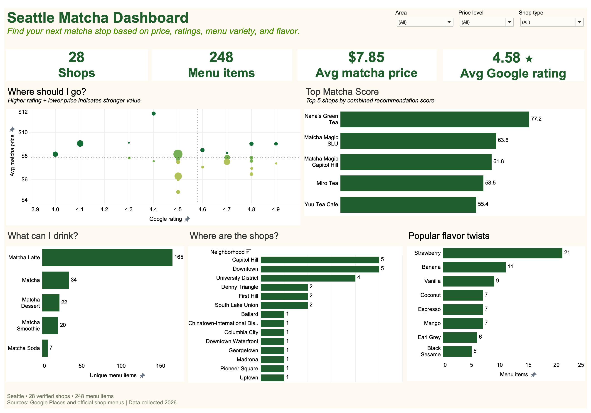

# Seattle Matcha Analytics

[](https://public.tableau.com/app/profile/tuyet.tran6053/viz/Seattle_Matcha_Analytics_Dashboard/Dashboard1)

**[Explore the interactive Tableau Public dashboard](https://public.tableau.com/app/profile/tuyet.tran6053/viz/Seattle_Matcha_Analytics_Dashboard/Dashboard1)**

An end-to-end analytics project answering:

> Where should a matcha lover go in Seattle based on location, price, ratings,
> menu variety, and flavor preferences?

## Current release

- Seattle only
- 28 verified shops
- 248 human-validated matcha menu items
- 100% complete itemized menus and price coverage
- Google Places API discovery and shop metadata
- AI-assisted menu extraction with human validation
- Python transformation, SQLite, SQL, Excel, and Tableau-ready outputs

## Data pipeline

```text
Google Places + official menus
              ↓
     data/raw source evidence
              ↓
     AI extraction + human review
              ↓
        data/interim clean data
              ↓
   Python feature engineering
              ↓
 data/processed analytics + SQLite
              ↓
 SQL reports + Tableau-ready sources
```

The canonical menu source is:

`data/raw/menu_items_verified_source.xlsx`

Derived CSVs must not be edited manually. After changing the verified workbook,
rebuild all downstream outputs with:

```bash
python src/run_pipeline.py
```

## Folder structure

```text
data/raw/        Canonical inputs and original source evidence
data/archive/    Completed pilot files retained for provenance
data/interim/    Reproducible cleaning-stage outputs
data/processed/  Final analysis-ready CSVs and SQLite database
data/tableau/    Stable Tableau-ready relationship tables
reports/         Exported SQL query results
sql/             Reusable business queries
src/             Collection, extraction, validation, and build scripts
tests/           Automated schema and transformation tests
```

See `data/README.md` for the role of every data folder.

## Collection methodology

Candidate shops were identified through multiple product- and location-based
Google Places queries to reduce ranking bias. A business qualified only when it
had a physical Seattle location and an officially verifiable matcha-based menu
item. Official websites, ordering pages, and menus were used as menu sources.

## AI-assisted extraction

Official menu text was transformed into structured records with
`gpt-5.6-luna` Structured Outputs. Raw model responses remain in
`data/raw/ai_menu_extractions/`. Every final menu record was checked against its
official source and consolidated into the canonical verified workbook.

## Final analytical outputs

- `data/processed/shops_analytics.csv`
- `data/processed/menu_items_analytics.csv`
- `data/processed/data_quality_report.csv`
- `data/processed/seattle_matcha.db`
- `reports/sql_results/`

SQL business questions are defined in `sql/business_queries.sql` and executed
against SQLite by `src/run_sql_analysis.py`.

## Key findings

- Seattle's 28 verified shops offer 248 matcha menu items at an average
  shop-level price of `$7.85`.
- Capitol Hill and Downtown have the greatest shop coverage, with five verified
  locations each; Capitol Hill also has the largest verified menu inventory at
  56 items.
- Matcha and tea specialists average 12.5 menu items per shop, more than twice
  the 5.7-item average at general coffee shops.
- Strawberry is the most widely available flavor twist: 22 menu items across 16
  shops.
- Nana's Green Tea leads the project-defined Matcha Score at 77.2, driven by its
  broad 31-item menu, large review base, rating, and price position.

## Matcha Score methodology

Matcha Score is a custom 0–100 recommendation metric combining four shop-level
dimensions:

| Component | Weight | Source field |
|---|---:|---|
| Google rating | 35% | `google_rating` |
| Menu variety | 30% | `menu_item_count` |
| Review popularity | 20% | `log1p(google_review_count)` |
| Affordability | 15% | Inverse of `avg_matcha_price` |

Each component is min-max normalized across eligible shops to a 0–1 scale. Review
count is log-transformed before normalization so a small number of highly reviewed
businesses do not dominate the score. Affordability is inverted so lower average
prices receive higher values.

```text
Matcha Score = 100 × (
    0.35 × normalized rating
  + 0.30 × normalized menu variety
  + 0.20 × normalized log review popularity
  + 0.15 × normalized affordability
)
```

Only shops with a complete menu, an average menu price, a Google rating, and a
Google review count are eligible. In the current release, all 28 shops qualify.

This score is a transparent project-defined recommendation metric, not an
objective measure of matcha quality. It reflects the selected balance of customer
ratings, menu breadth, popularity, and price; the dataset does not directly measure
taste, ingredient quality, preparation skill, or individual customer preferences.

## Tableau

Use the three files in `data/tableau/` and create relationships rather than
physical joins. Relationship fields and setup instructions are documented in
`data/tableau/README.md`.

The published dashboard provides three interactive filters—area, price level,
and shop type—and answers the project's core questions through:

- price-versus-rating shop comparison;
- a dynamic Top 5 Matcha Score leaderboard within the selected segment;
- menu category and flavor analysis; and
- Seattle neighborhood coverage.

Tableau Public:
[`Seattle Matcha Analytics Dashboard`](https://public.tableau.com/app/profile/tuyet.tran6053/viz/Seattle_Matcha_Analytics_Dashboard/Dashboard1)

## Reproduce locally

Create a virtual environment, install the pinned dependency ranges, then rebuild
all derived outputs from the canonical inputs:

```bash
python -m venv .venv
source .venv/bin/activate
pip install -r requirements.txt
python src/run_pipeline.py
python -m unittest discover -s tests -v
```

API keys are needed only when collecting new Google Places data or extracting new
menus. Store them in `.env`; the committed analytical pipeline rebuilds without
making external API calls.

## Planned extension

The same pipeline can later be extended to Bellevue, Lynnwood, and Federal Way.
